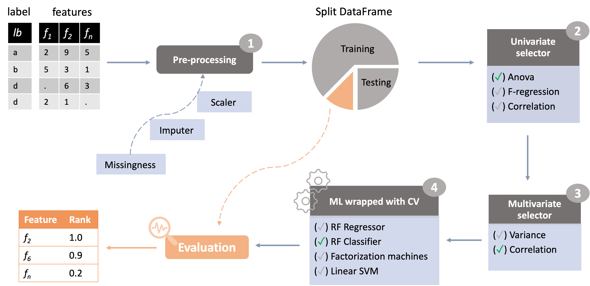

[](https://github.com/enriquea/fsspark/actions/workflows/python-app.yml)

# fsspark

---

## Feature selection in Spark

### Description

*fsspark* is a python module to perform feature selection and machine learning based on spark.
Pipelines written using *fsspark* can be divided roughly in four major stages: 1) data pre-processing, 2) univariate 
filters, 3) multivariate filters and 4) machine learning wrapped with cross-validation (Fig 1).


*Figure 1. Feature selection workflow example implemented in fsspark.*

### 1. Data pre-processing

- a) Filtering by missingness rate. 
   - Remove features from dataset with high missingness rates across samples.
- b) Impute missing values.
     - Impute features missing values using mean, median or mode.
- c) Scale features.
   - Normalize features using MinMax, MaxAbs, Standard or Robust methods.

### 2. Available univariate filters

- a) Univariate correlation
  - Compute correlation between features and a target response variable and keep
    uncorrelated features.
- b) Anova test
  - Select features based on an Anova test between features and a target response 
    variable (categorical).
- c) F-regression
  - Select features based on a F-regression test between features and a target response 
    variable (continuous).

### 3. Available multivariate filters

- a) Multivariate correlation
  - Compute pair-wise correlation between features and remove highly correlated features.
- b) Variance
  - Remove features with low-variance across samples.

### 4. Machine-learning methods with cross-validation

- a) Random Forest classification
  - For classification tasks on both binary and multi-class response variable (categorical).
- b) Linear Support Vector Machine
  - For classification tasks on binary response variable.
- c) Random Forest regression
  - For regression tasks (e.g. continuous response variable).
- d) Factorization Machines
  - For regression problems (e.g. continuous response variable).

### How to install

[...]

### Feature selection pipeline example

Check it out [here](fsspark/pipeline/fs_corr_rf.py) a full FS pipeline example.

```python
"""
Example of a feature selection pipeline implemented in fsspark.

After data import and pre-processing, the pipeline applies univariate correlation filter,
multivariate correlation filter and Randon Forest classification.

"""

from fsspark.context import init_spark, stop_spark_session
from fsspark.fs.core import FSDataFrame
from fsspark.fs.ml import cv_rf_classification, get_accuracy, get_predictions
from fsspark.fs.multivariate import multivariate_filter
from fsspark.fs.univariate import univariate_filter
from fsspark.fs.utils import (filter_missingness_rate,
                              impute_missing)
from fsspark.utils.datasets import get_tnbc_data_path
from fsspark.utils.io import import_table_as_psdf

# Init spark
init_spark()

# Import data
fsdf = import_table_as_psdf(get_tnbc_data_path(),
                            n_partitions=5)

fsdf = FSDataFrame(fsdf, sample_col='Sample', label_col='label')

# Step 1. Data pre-processing.

# a) Filter missingness rate
fsdf = filter_missingness_rate(fsdf,
                               threshold=0.1)

# b) Impute data frame
fsdf = impute_missing(fsdf)

# c) Scale features
fsdf = fsdf.scale_features(scaler_method='standard')

# Split dataset in training/testing
training_df, testing_df = fsdf.split_df(label_type_cat=True,
                                        split_training_factor=0.8)

# Step 2. Apply univariate correlation filter
training_df = univariate_filter(training_df,
                                univariate_method='u_corr',
                                corr_threshold=0.3)

# Step 3. Apply multivariate correlation filter
training_df = multivariate_filter(training_df,
                                  multivariate_method='m_corr',
                                  corr_threshold=0.7
                                  )

# Step 4. ML-algorithm with cross-validation
cv_model = cv_rf_classification(training_df,
                                binary_classification=False)

# Print out some stats

# Get accuracy from training
acc = get_accuracy(model=cv_model)
print(f"Training accuracy: {acc}")

# Get predictions from training
pred = get_predictions(model=cv_model)
pred.show()

stop_spark_session()
```

### Maintainers

[...]
