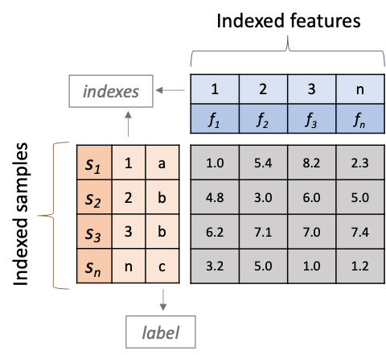

## fsspark - data structures

--- 

`fsspark` is a Python package that provides a set of tools for feature selection in Spark. 
Here we describe the main data structures used in `fsspark` and how to use them.

### Input data

The current module support as input data a headed Tab-separated values (TSV) file with `S x 2+F` dimensions, 
where `S` is the number of samples (rows) and `F` is the number of features (columns). The first column of the file 
is expected to contain the `sample IDs`, the second column the `sample label` and the remaining
columns the `features`. The response variable can be either binary, categorical or continuous; and should
be encoded as `0` and `1` for binary variables, as integers for categorical variables and as floats
for continuous variables.

**Hint:** Block-compressed TSV files with `bgzip` are supported, and speeds up the loading process.

The following is an example of a TSV file with a binary response variable:

```
------------------------------------------------------------------------
| sample_id | label | feature_1 | feature_2 | feature_3 | feature_4 |
------------------------------------------------------------------------
| sample_1  | a        | 0.1       | 0.2       | 0.3       | 0.4       |
| sample_2  | b        | 0.5       | 0.6       | 0.7       | 0.8       |
| sample_3  | b        | 0.9       | 0.10      | 0.11      | 0.12      |
| sample_4  | c        | 0.13      | 0.14      | 0.15      | 0.16      |
------------------------------------------------------------------------

```

### Import functions

`fsspark` provides two main functions to import data from a TSV file.

- `import_table` - Import data from a TSV file into a Spark Data Frame (sdf).

```python
from fslite.utils.io import import_table

sdf = import_table('data.tsv.bgz',
                   sep='\t',
                   n_partitions=5)
```

- `import_table_as_psdf` - Import data from a TSV file into a Spark Data Frame (sdf) and 
convert it into a Pandas on Spark Data Frame (psdf).

```python
from fslite.utils.io import import_table_as_psdf

psdf = import_table_as_psdf('data.tsv.bgz',
                            sep='\t',
                            n_partitions=5)
```

### The Feature Selection Spark Data Frame (FSDataFrame)

The `FSDataFrame` (**Figure 1**) is a core functionality of `fsspark`. It is a wrapper around a Spark Data Frame (sdf) 
that provides a set of methods to facilitate feature selection tasks. The `FSDataFrame` is initialized 
with a Spark Data Frame (sdf) or a Pandas on Spark Data Frame (psdf) and two mandatory arguments: 
`sample_col` and `label_col`. The `sample_col` argument is the name of the column in the sdf that 
contains the sample IDs, and the `label_col` argument is the name of the column in the sdf that 
contains the response variable.

`Warning:` dots in columns names are replaced automatically by underscores.



**Figure 1.** Schematic representation of the Feature Selection Spark Data Frame (FSDataFrame).


#### How to create a Feature Selection Spark Data Frame (FSDF)

```python
from fslite.config.context import init_spark, stop_spark_session
from fslite.fs.core import FSDataFrame
from fslite.utils.io import import_table_as_psdf

# Init spark
init_spark()

# Import data
psdf = import_table_as_psdf('data.tsv.bgz',
                            sep='\t',
                            n_partitions=5)
# Create FSDataFrame
fsdf = FSDataFrame(psdf,
                   sample_col='sample_id',
                   label_col='response')
# Stop spark
stop_spark_session()
```


### Example Dataset

- Triple-Negative Breast Cancer (TNBC) dataset from
[GSE76250](https://www.ncbi.nlm.nih.gov/geo/query/acc.cgi?acc=GSE76250). The TNBC dataset is a small dataset intended 
for testing purposes. It contains 44 samples and 500 features. [link to tsv file]()


- Fetal human cell atlas (FHCA) dataset from [GSE156793](https://www.ncbi.nlm.nih.gov/geo/query/acc.cgi?acc=GSE156793).
The FHCA is a single-cell RNA-seq dataset profiling ~4M cells in >120 samples. [link to tsv file]()


